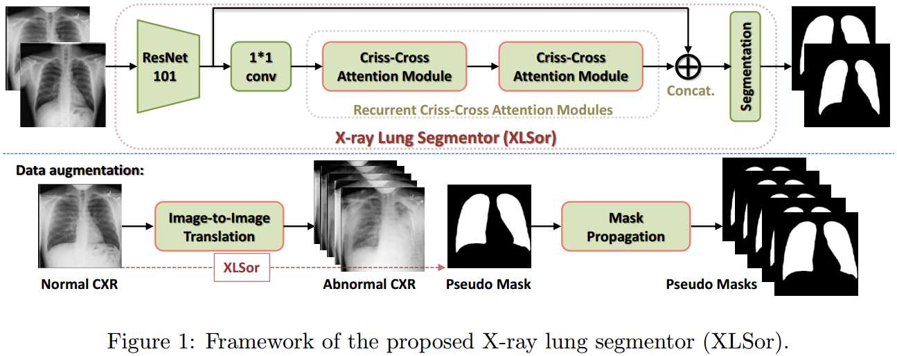
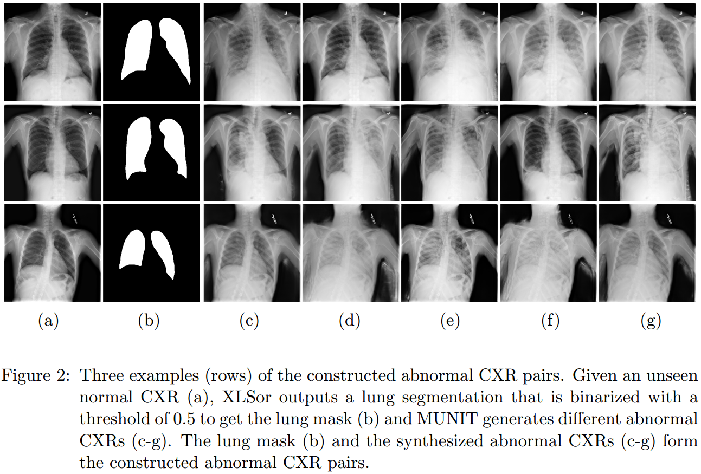

# [XLSor: A Robust and Accurate Lung Segmentor on Chest X-Rays Using Criss-Cross Attention and Customized Radiorealistic Abnormalities Generation](https://openreview.net/pdf?id=B1lpb10Ry4)
Developed by [Youbao Tang](https://tangyoubao.github.io/), Imaging Biomarkers and Computer-Aided Diagnosis Laboratory, National Institutes of Health Clinical Center.

We implement our method based on the open source [CCNet](https://github.com/speedinghzl/CCNet). 

## Introduction
In this work, we  propose  a  robust  and  accurate  lung  segmentor  based  on  a  criss-cross attention  network  and  a  customized  radiorealistic  abnormalities  generation  technique  for data augmentation. The overall XLSor framework is shown in Figure 1. Given a training set R with ground-truth masks, an initial lung segmentor (XLSor, developed based on [CCNet](https://github.com/speedinghzl/CCNet)) is trained. Then, for an auxiliary external set, an image-to-image method [MUNIT](https://github.com/NVlabs/MUNIT)  is used to synthesize abnormal CXRs from normal ones, so as to augment the training data and pseudo mask annotations (mask of normal CXR is obtained using the initial lung segmentor and propagated to its synthesized abnormal CXRs, see examples in Figure 2). The initial lung segmentor is updated using R along with the augmented dataset A with pseudo masks and used for lung segmentation (see some segmentation results in Figure 3). 





### Data and model
The [data](https://nihcc.box.com/s/r8kf5xcthjvvvf6r7l1an99e1nj4080m) used in this work and the [trained model](https://nihcc.box.com/s/p2ivp7llqajelnamofocgy0wujui51vn) can be downloaded from our lab Box Drive ([data](https://nihcc.box.com/s/r8kf5xcthjvvvf6r7l1an99e1nj4080m) and [model](https://nihcc.box.com/s/p2ivp7llqajelnamofocgy0wujui51vn)), including the augmented data and the annotated NIH data. Another two public chest X-ray datasets ([JSRT](http://db.jsrt.or.jp/eng.php) and [Montgomery](http://openi.nlm.nih.gov/imgs/collections/NLM-MontgomeryCXRSet.zip)) can be download from their websites.

Put the downloaded data into ./data/ and the trained model into ./models/

### Citing XLSor
The paper about XLSor can be downloaded from [here](https://openreview.net/pdf?id=B1lpb10Ry4).

If you find XLSor and the data (including the augmented data and the annotated NIH data) useful in your research, please consider citing:

    @inproceedings{tang2019xlsor,
        title={XLSor: A Robust and Accurate Lung Segmentor on Chest X-Rays Using Criss-Cross Attention and Customized Radiorealistic Abnormalities Generation},
        author={Tang, Youbao and Tang, Yuxing and Xiao, Jing and Summers, Ronald M},
        booktitle = {International Conference on Medical Imaging with Deep Learning (MIDL)},
        year={2019}
    }
    
### Requirements

To install PyTorch>=0.4.0, please refer to https://github.com/pytorch/pytorch#installation.   
4 x 12G GPUs (_e.g._ TITAN XP)

### Compiling
Please download the folders of cc_attention, libs and utils from the project of [CCNet](https://github.com/speedinghzl/CCNet) and follow their compiling processes as CCNet:

Some parts of **InPlace-ABN** and **Criss-Cross Attention** have native CUDA implementations, which must be compiled with the following commands:
```bash
cd libs
sh build.sh
python build.py

cd ../cc_attention
sh build.sh
python build.py
``` 
The `build.sh` script assumes that the `nvcc` compiler is available in the current system search path.
The CUDA kernels are compiled for `sm_50`, `sm_52` and `sm_61` by default.
To change this (_e.g._ if you are using a Kepler GPU), please edit the `CUDA_GENCODE` variable in `build.sh`.

Please replace the CrossEntropyLoss with MSELoss in the file of utils/criterion.py, where self.criterion should be "torch.nn.MSELoss(size_average=True)" instead of "torch.nn.CrossEntropyLoss(ignore_index=ignore_index, reduce=reduce)".

### Pretrained model

Please download MIT imagenet pretrained [resnet101-imagenet.pth](http://sceneparsing.csail.mit.edu/model/pretrained_resnet/resnet101-imagenet.pth), and put it into `dataset` folder.

### Training and Testing

Change the arguments and run the following commands for training and testing.

```bash
python train.py
python test.py
``` 

## Thanks to the Third Party Libs 
[CCNet: Criss-Cross Attention for Semantic Segmentation](https://github.com/speedinghzl/CCNet)    
[Multimodal Unsupervised Image-to-Image Translation](https://github.com/NVlabs/MUNIT)

